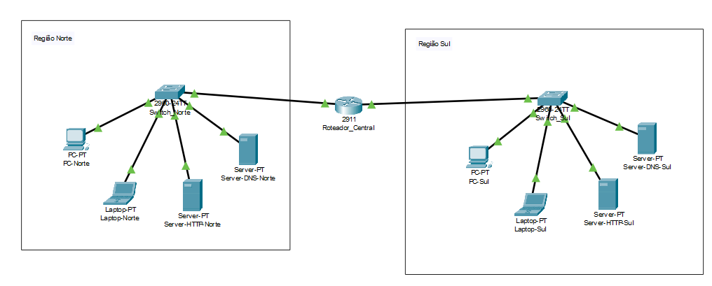
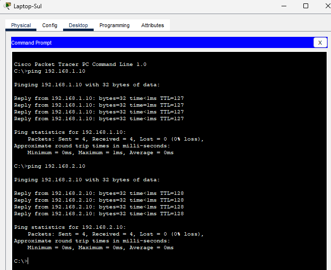
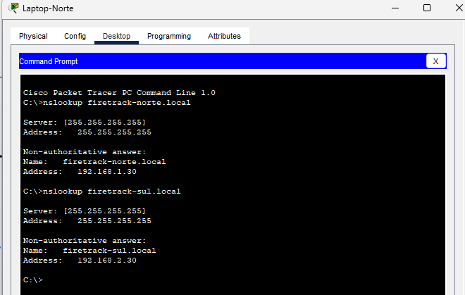
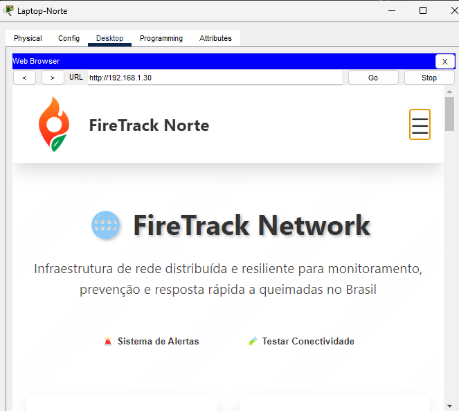

<p align="center">
    <picture>
        <source media="(prefers-color-scheme: dark)" srcset="https://raw.githubusercontent.com/GSFireTrack/.github/main/utils/logo/logoDarkHD.png">
        
    </picture>
</p>

# 🌐 FireTrack Network

<details open>
    <summary><h3><strong>📑 Sumário</strong></h3>
        <ol>
            <li><a href="#info">Informações</a></li>
            <li><a href="#equipe">Equipe</a></li>
            <li><a href="#sobre-o-projeto">Sobre o Projeto</a></li>
            <li><a href="#arquitetura-de-rede">Arquitetura de Rede</a></li>
            <li><a href="#funcionalidades-principais">Funcionalidades Principais</a></li>
            <li><a href="#estrutura-do-projeto">Estrutura do Projeto</a></li>
            <li><a href="#como-implementar">Como Implementar</a></li>
            <li><a href="#testes-realizados">Testes Realizados</a></li>
            <li><a href="#objetivo">Objetivo</a></li>
        </ol>
    </summary>
</details>

<h2 id="info"> ℹ️ Informações </h2>

<table>
  <tr>
    <td><strong>Organização Github</strong></td>
    <td><a href="https://github.com/GSFireTrack">GSFireTrack</a></td>
  </tr>
  <tr>
    <td><strong>Link do PDF</strong></td>
    <td><a href="./Docs.docx">Documentação do Projeto</a></td>
  </tr>
  <tr>
    <td><strong>Arquivo Packet Tracer</strong></td>
    <td><a href="./FireTrack_Network.pkt">FireTrack_Network.pkt</a></td>
    </tr>
  <tr>
    <td><strong>Disciplina</strong></td>
    <td>Network Architect Solutions</td>
  </tr>
  <tr>
    <td><strong>Turma</strong></td>
    <td>2ESPX</td>
  </tr>
</table>

<h2 id="equipe"> 👥 Equipe </h2>

| Integrante                      | RM     |
| ------------------------------- | ------ |
| Augusto Barcelos Barros         | 565065 |
| Jefferson Junior Alvarez Urbina | 558497 |

<h2 id="sobre-o-projeto"> 🌐 Sobre o Projeto </h2>

O **FireTrack Network** é uma solução de infraestrutura de rede voltada para **monitoramento, prevenção e resposta rápida a queimadas no Brasil**. O projeto implementa uma arquitetura de rede distribuída e resiliente, capaz de manter operações críticas mesmo durante eventos extremos como os incêndios florestais.

Inspirado pelos recentes incêndios em Los Angeles e pelos desafios enfrentados por data centers durante queimadas, o FireTrack Network propõe uma **infraestrutura geograficamente distribuída** que garante:

- 🔄 **Continuidade operacional** durante desastres naturais
- 🌍 **Monitoramento distribuído** entre diferentes regiões
- 📡 **Redundância de conectividade** e serviços
- 🚨 **Resposta automatizada** a emergências

O sistema integra **dados oficiais do INPE**, **sensores IoT** e **tecnologias de rede avançadas** para criar uma plataforma robusta de combate às queimadas, onde a infraestrutura de rede é tanto ferramenta quanto alvo de proteção.

<h2 id="arquitetura-de-rede"> 🏗️ Arquitetura de Rede </h2>

### 🌎 Topologia

```
  REGIÃO NORTE (192.168.1.1/24)                    REGIÃO SUL (192.168.2.1/24)
  ┌────────────────────────────┐                 ┌────────────────────────────┐
  │       MONITORAMENTO        │                 │        PROCESSAMENTO       │
  │         AMBIENTAL          │                 │         PRINCIPAL          │
  │                            │                 │                            │
  │       [Switch-Norte]       │                 │        [Switch-Sul]        │
  │        192.168.1.1         │                 │        192.168.2.1         │
  │              │             │                 │              │             │
  │    ┌──────┬──┼──┬──────┐   │                 │    ┌──────┬──┼──┬──────┐   │
  │    │      │     │      │   │                 │    │      │     │      │   │
  │ [PC-N] [NB-N] [HTTP] [DNS] │                 │ [PC-N] [NB-N] [HTTP] [DNS] │
  │  .10    .20    .30    .40  │                 │  .10    .20    .30    .40  │
  │                            │                 │                            │
  └────────────┬───────────────┘                 └──────────────┬─────────────┘
               │                                                │
               │          ┌──────────────────────────┐          │
               └──────────┤     ROTEADOR CENTRAL     ├──────────┘
                          │   Gig0/0      Gig0/1     │
                          │ 192.168.1.1  192.168.2.1 │
                          └──────────────────────────┘
```

</img>

### 🛜 Configurações de Rede

| Dispositivo   | Região Norte | Região Sul   |
| ------------- | ------------ | ------------ |
| PC Desktop    | 192.168.1.10 | 192.168.2.10 |
| Notebook      | 192.168.1.20 | 192.168.2.20 |
| Servidor HTTP | 192.168.1.30 | 192.168.2.30 |
| Servidor DNS  | 192.168.1.40 | 192.168.2.40 |

| Região       | Gateway     |
| ------------ | ----------- |
| Região Norte | 192.168.1.1 |
| Região Sul   | 192.168.2.1 |

#### Roteador Central

| Interface | Endereço IP | Região       |
| --------- | ----------- | ------------ |
| Gig0/0    | 192.168.1.1 | Região Norte |
| Gig0/1    | 192.168.2.1 | Região Sul   |

<h2 id="funcionalidades-principais"> 🌟 Funcionalidades Principais </h2>

- 🗺️ **Mapa Interativo Distribuído**  
  Visualização geográfica de focos de calor com dados replicados entre regiões, garantindo acesso mesmo durante falhas locais.

- 🔄 **Redundância Automática de Serviços**  
  Failover automático entre servidores das duas regiões, com sincronização em tempo real de dados críticos.

- 📡 **Monitoramento de Infraestrutura**  
  Supervisão contínua da saúde da rede, com alertas automáticos para falhas de conectividade ou equipamentos.

- 🌐 **Conectividade Resiliente**  
  Múltiplos links de internet por região, com balanceamento de carga e failover transparente.

- 📊 **Dashboard de Status da Rede**  
  Interface web mostrando status em tempo real de todos os componentes da infraestrutura.

- 🚨 **Sistema de Alertas Integrado**  
  Notificações automáticas sobre queimadas próximas a data centers ou infraestrutura crítica.

- 💾 **Backup Geográfico Distribuído**  
  Replicação automática de dados entre regiões, garantindo continuidade mesmo com perda total de uma região.

<h2 id="estrutura-do-projeto"> 📁 Estrutura do Projeto </h2>

```
Network/
├── README.md                           # Documentação principal do projeto
├── GS2025_Queimadas_FireTrack.pkt      # Arquivo Packet Tracer com a rede
├── Docs.docx                           # Documentação
└── utils/                              # Recursos auxiliares
    ├── img/                            # Imagens usadas no projeto/README
    │   └── Network_Topology_Diagram.png
    │
    └── pdfs/                           # PDFs de referência ou manuais
        ├── ES - PROTOCOL HTTP - Cisco.pdf
        └── Orientações_GS_2ES.pdf
```

<h2 id="como-implementar"> 🚀 Como Implementar </h2>

### **Pré-requisitos**

- [x] Cisco Packet Tracer instalado
- [x] Conhecimento básico em redes e protocolos de comunicação

### **Implementação Passo a Passo**

1. **📥 Clone o repositório**

   ```bash
   git clone https://github.com/GSFireTrack/Network
   cd Network
   ```

2. **🌐 Abra o arquivo no Packet Tracer**

   - Abra o Cisco Packet Tracer
   - Carregue o arquivo [`GS2025_Queimadas_FireTrack.pkt`](./GS2025_Queimadas_FireTrack.pkt)

3. **🧪 Execute os testes de conectividade**

   - Ping entre regiões: `PC-Norte → PC-Sul`
   - Acesso ao servidor web: `http://192.168.2.30`
   - Resolução DNS: `nslookup firetrack.local`

4. **🌐 Acesse a interface web**
   - Abra `web/index.html` em um navegador
   - Ou acesse via browser (IP: 192.168.1.30 | 192.168.2.30) no Packet Tracer

<h2 id="testes-realizados"> 🧪 Testes Realizados </h2>

### **1. ✅ Teste de Conectividade Básica**

```bash
PC-Norte> ping 192.168.2.10
Melhor Resultado: ✅ Sucesso (Pacotes: 4 enviados, 4 recebidos, 0% de perda)
```



### **2. ✅ Teste de Resolução DNS**

```bash
PC-Norte> nslookup firetrack-sul.local
Resultado: ✅ IP resolvido corretamente (IP: 192.168.2.30)
```



### **3. ✅ Teste de Acesso Web**

```bash
Browser> http://192.168.1.30
Resultado: ✅ Interface FireTrack carregada
```



<h2 id="objetivo"> 🎯 Objetivo </h2>

O objetivo do **FireTrack Network** é **garantir continuidade operacional de sistemas críticos de monitoramento de queimadas**, mesmo durante eventos extremos que possam afetar a infraestrutura tecnológica.

### **Metas Principais:**

1. **🛡️ Resiliência da Infraestrutura**

   - Proteger data centers e sistemas de comunicação contra impactos de incêndios
   - Garantir operação contínua mesmo com falhas regionais

2. **📡 Conectividade Ininterrupta**

   - Manter comunicação entre equipes de combate a incêndios
   - Preservar acesso a sistemas de monitoramento críticos

3. **💾 Proteção de Dados**

   - Evitar perda de dados históricos sobre queimadas
   - Garantir backup geográfico distribuído

4. **⚡ Resposta Rápida**
   - Reduzir tempo de detecção e resposta a incêndios
   - Automatizar processos de failover e recuperação

### **Impacto Esperado:**

Ao combinar **arquitetura de rede resiliente** com **tecnologias de monitoramento ambiental**, o FireTrack Network visa criar um ecossistema tecnológico que seja tanto **ferramenta de combate às queimadas** quanto **infraestrutura protegida contra seus efeitos**.

O projeto demonstra como princípios de **engenharia de redes** podem ser aplicados a problemas ambientais críticos, criando soluções que fortalecem tanto a **proteção ambiental** quanto a **continuidade tecnológica**.
